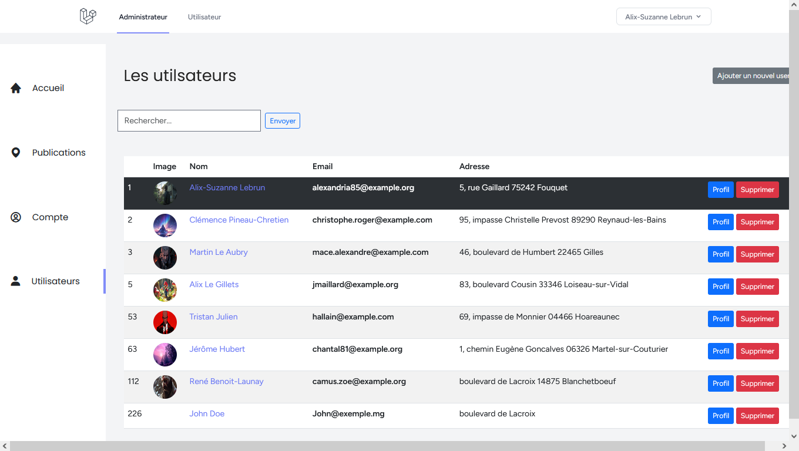
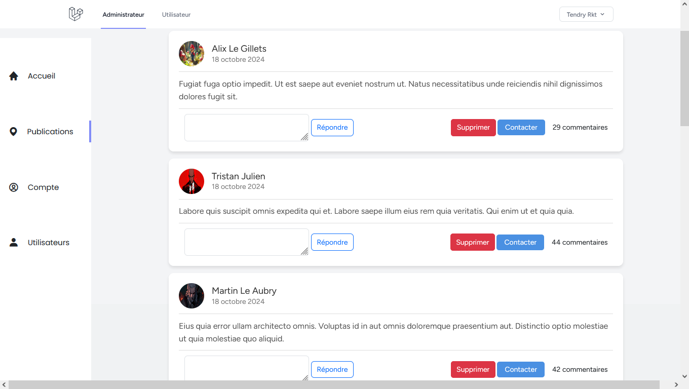
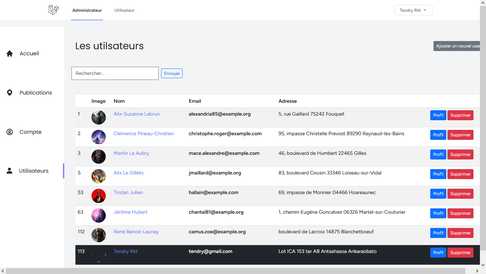
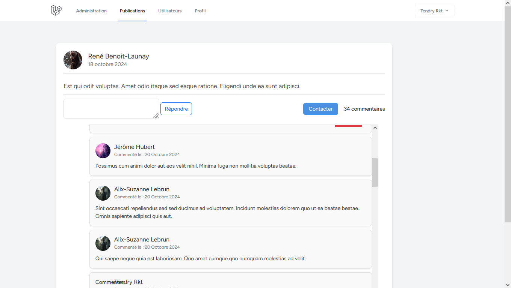

# Projet Laravel - Système de Publication et de Commentaires

## Description

Ce projet est une application web développée avec Laravel qui permet aux utilisateurs de créer des comptes, publier du contenu, et commenter les publications des autres utilisateurs. L'application inclut également une interface d'administration pour gérer les publications, les commentaires et les utilisateurs.

### Fonctionnalités

- **Inscription et Connexion** : Les utilisateurs peuvent créer un compte, se connecter et accéder à leurs profils.
- **Création de Publications** : Les utilisateurs connectés peuvent publier du contenu (texte et images).
- **Commenter les Publications** : Les utilisateurs peuvent commenter les publications existantes.
- **Interface Administrateur** : Accès restreint aux utilisateurs avec privilèges d'administrateur pour gérer l'ensemble du système.

## Installation

Suivez les étapes ci-dessous pour configurer le projet localement :

1. **Cloner le dépôt**

   ```bash
   git clone https://github.com/votre-utilisateur/votre-projet.git

2. **Naviguer dans le dossier du projet**

3. **Ouvrez .env et modifiez les paramètres pour votre configuration de base de données locale** 

    Avant de lancer l'application, assurez-vous de configurer correctement le fichier .env en y renseignant les informations de connexion à la base de données, ainsi que les autres variables d'environnement nécessaires."

4. **Migrer la base de données et exécuter les seeders**
    Exécuter la commande `php artisan migrate --seed`

5. **Lancer le serveur de développement**
    Exécuter la commande `php artisan serve`


## Informations de connexion 
  ### Administrateur
      - URL de connexion : 'http://localhost:8000/login'
      - Email : admin01@gmail.com
      - Mot de passe : admin01

## Illustrations








## Contributions
Les contributions sont les bienvenues ! Veuillez ouvrir une issue ou soumettre une pull request pour toute amélioration ou correction de bugs.

## Contact
- **Nom** : Tendry Zéphyrin
- **Email** : tendryzephyrin@gmail.com
- **GitHub** : [Tendry-Rkt56](https://github.com/Tendry-Rkt56)
